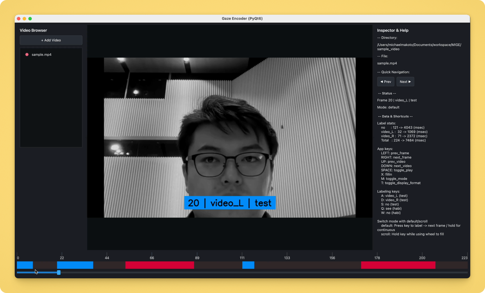

# MIGE (Manual Infant Gaze Encoder)
Michael Makoto Martinsen

## Overview
- A simple tool to manually annotate gaze direction per video frame for infant research.
- Drag in a video, step through frames, and assign labels with keyboard-driven workflows.
- Saves annotations to a CSV (`<video_name>_labels.csv`) and renders a color-coded timeline of label spans.
- Behavior and labeling scheme come from `encode_settings.json` (labels, colors, shortcuts, timing



<div><video controls src="https://github.com/user-attachments/assets/73007d76-edd0-4f79-81b0-cf2bed1c3b53" muted="false"></video></div>

## Setup
- Make sure your Mac/Windows machine can run `pyenv`
  - Mac: [pyenv](https://github.com/pyenv/pyenv) 
  - Windows: [pyenv-win](https://github.com/pyenv-win/pyenv-win)
- Use `pyenv install 3.14.0`, set it locally (e.g., `pyenv local 3.14.0`), create a virtualenv, and install deps with `pip install -r requirements.txt`.
- Quick start:
  ```bash
  pyenv install 3.14.0             # once
  pyenv local 3.14.0
  python -m venv .venv
  source .venv/bin/activate        # or .venv\\Scripts\\activate on Windows
  pip install -r requirements.txt
  ```

## Running the App
- Activate your virtualenv, then launch:
  ```bash
  python main.py
  ```
- Drag & drop a video file (mp4/avi/mov/mkv) into the window or click `+ Add Video`.
- The browser pane lists all videos in the same directory so you can hop between them.
- Use the control keymaps to label each frame
- Each frames label will be sutomatically saves as a CSV (`<video_name>_labels.csv`) in the same folder as the video
<div><video controls src="https://github.com/user-attachments/assets/b2ac5481-ef93-42b2-a052-215d4e302655" muted="false"></video></div>


## Controls (defaults from `encode_settings.json`)
- App navigation: 
  - `Left/Right` = prev/next frame
  - `Up/Down` = prev/next video
  - `Space` = play/pause
  - `M` = toggle labeling mode (default/scroll)
  - `F` = Fillin unlabeled gap, 
  - `T` = switch frame/time display
- Label keys: "Keycode": "label" (Label group)
  - `A` >> `video_L` (test), 
  - `D` >> `video_R` (test), 
  - `S` >> `no` (test), 
  - `Q` >> `see` (habi), 
  - `E` >> `no` (habi).
- Mouse: scroll wheel seeks; 
  - hold `Shift` to move faster. 
  - In scroll mode, hold a label key while scrolling to fill labels continuously.

## Workflow Tips
- Default mode: tap a label key to tag the current frame and auto-advance; hold to auto-label forward.
- Scroll mode: hold a label key and scroll to paint labels across frames.
- Use `Fillin` on an unlabeled frame between two matching labels to auto-fill the gap.
- `Timeline` bar shows label colors; tick marks can display frame numbers or timecodes (`T` to toggle).
- Closing the app saves CSV automatically.

## Configuration
- Edit `encode_settings.json` to adjust label tokens, colors, hotkeys, timing thresholds, mouse step size, and timeline formatting.
